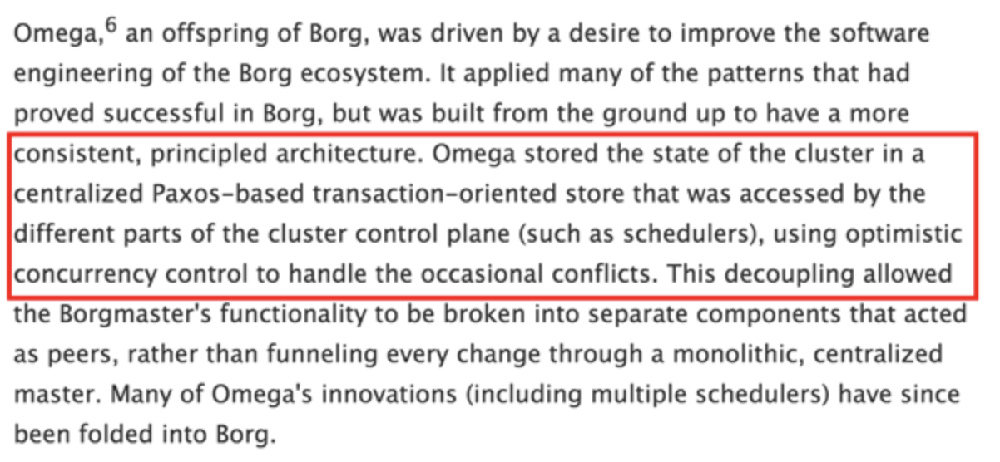

# Omega
## 背景
Google的第一代、第二代集群（资源）管理系统被称为Borg。Borg设计细节因零零星星出现在各种文章中而知名，但一直未公开。而在近期，Google公布了它的下一代集群管理系统Omega的设计细节。论文中谈到Google经历的三代资源调度器的架构，如图所示：

1. 中央式调度器架构(Monolithic)（Hadoop JobTracker，但是支持多种类型作业调度）
2. 双层调度器架构(Two-level)（Apache Mesos和Hadoop YARN）
3. 共享状态架构(Shared state)（Omega）

共享状态架构的出现解决了前两个架构方式的缺点，例如，各个框架无法知道整个集群的实时资源使用情况，与采用悲观锁，并发粒度小等。

## 设计特点
Omega可以说是Mesos的后继者，并且实际上有一个共同的作者。因为该论文对于其评估使用的是模拟的结果，我怀疑其从来没有在Google进入过生产，并且其中的理念被带入了下一代的Borg。即使对于Google来说，重写API很可能还是改动太大。

Omega将资源发放往前更推进了一步。在Mesos中，资源发放是悲观的(pessimistic)或者叫独占的(exclusive)。如果资源已发放给了一个应用，同样的资源不会发放给另外一个应用，除非该发放的资源超时。

Omega是一种基于共享状态的调度器，该调度器将双层调度器中的集中式资源调度模块简化成了一些持久化的共享数据（状态）和针对这些数据的验证代码，而这里的“共享数据”实际上就是整个集群的实时资源使用信息。

一旦引入共享数据后，共享数据的并发访问方式就成为该系统设计的核心，Omega则采用了传统数据库中基于多版本的并发访问控制方式（也称为“乐观锁”, MVCC, Multi-Version Concurrency Control），这大大提升了Omega的并发性。

ACM Queue（美国计算机学会ACM发行的商业杂志）最近也发表了一篇文章（Borg, Omega, and Kubernetes：Lessons learned from three container-management systems over a decade），详细介绍了Omega的“共享状态”调度以及“乐观并发”策略。

## 优势
Omega的资源管理器，本质上是一个保存着每一个节点的状态关系数据库，并且用不同的乐观并发控制来解决冲突。这样的好处是其大大的提高了调度器的性能(完全的并行，full parallelism)和资源利用率。

## 缺点
不足的的地方是，应用处于一种可以随时独占天下的状态，因为它们允许以任意的速度吞食资源，甚至抢占在其他用户之前。

然而，这对于Google来说是可行的，因为他们使用的系统是基于优先级的，并且可以对着他们内部的用户。他们的任务量大概分为两种优先级类：高优先级的服务类作业(HBase，web 服务器，长期运行的服务)和低优先级的批量式作业(MapReduce等类似的)。应用允许抢占低优先级的作业，并且可以停留在靠合作式强力取得的范围内，包括提交的作业数，分配的资源大小等。

## 思考
不同的应用场景下，不同的架构模式各有利弊。Omega架构模式较为适合现在Google的业务需求，同时改进了调度器的并发性，大大提升了系统的性能与资源利用率，共享资源状态，支持更大的集群和更高的并发。所以，应当多多改进现有的技术，做到更好地适应应用环境。
## 参考文献

[解析Google集群资源管理系统Omega](http://dongxicheng.org/mapreduce-nextgen/google-omega/)

[Mesos、Omega和Borg三个系统有什么区别?](http://cloud.51cto.com/art/201508/487999.htm)

[十大主流集群调度系统大盘点](https://blog.csdn.net/vip_iter/article/details/80123228)
