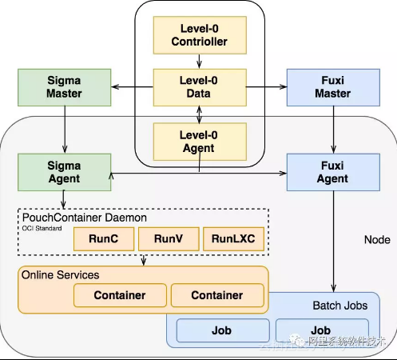
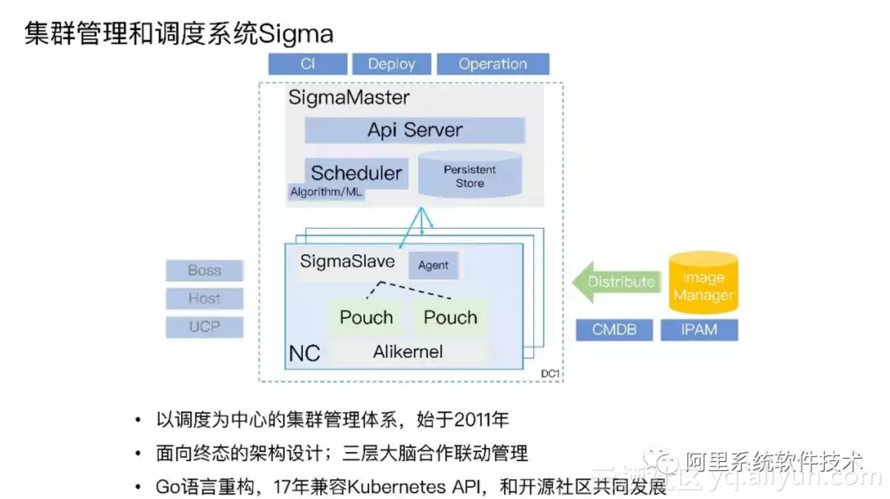
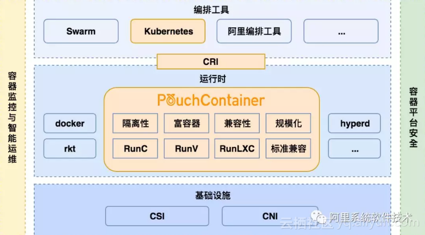
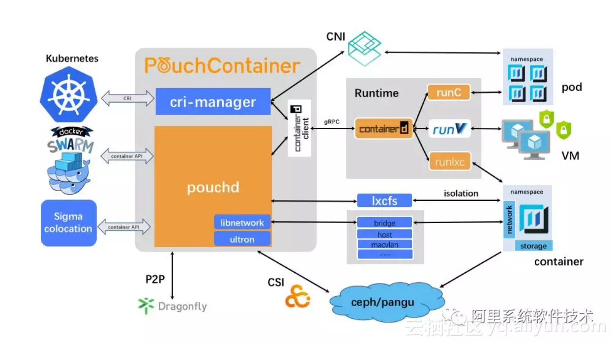
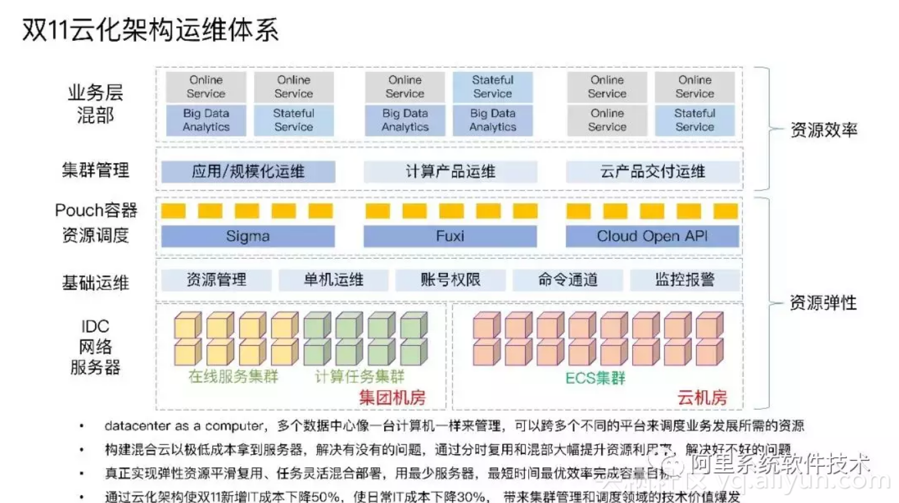
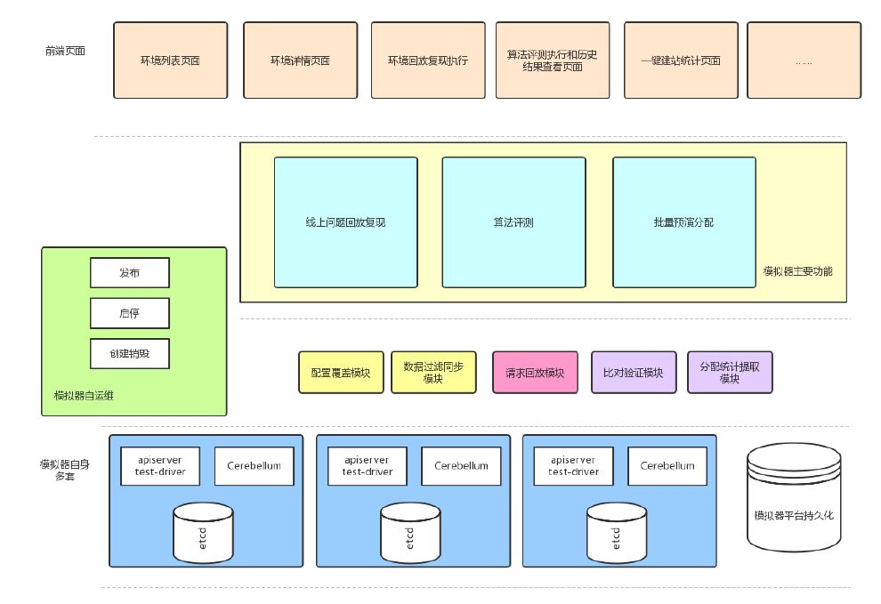
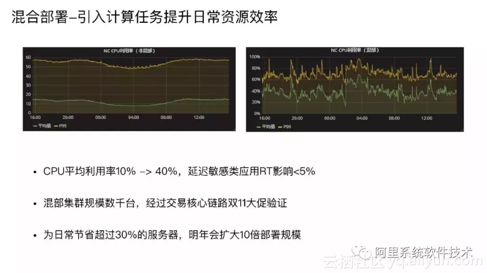
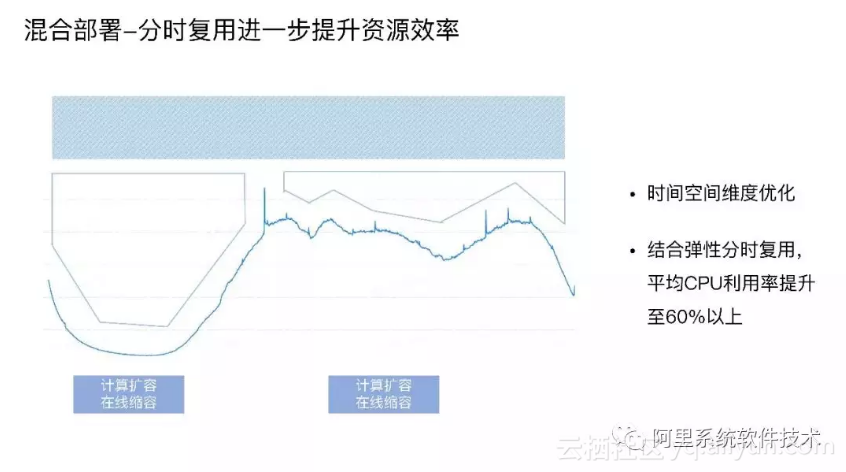

Sigma是阿里是服务阿里巴巴在线业务的自动化调度集群管理系统。通过与fuxi计算任务调度系统混合部署，用于提高数据中心的机器利用率。 

  
在线服务属于长生命周期、规则策略复杂性高、时延敏感类任务。 
计算任务生命周期短、调度要求大并发高吞吐、任务有不同的优先级、对时延不敏感。 
基于这两种调度的本质诉求的不同，在混合部署的架构上把两种调度并行处理，即一台物理机上可以既有 Sigma 调度又有 Fuxi 调度，实现基础环境统一。 

#一、主要架构
1. 集群管理和调度系统 
  

Sigma 有 Alikenel、SigmaSlave、SigmaMaster 三层大脑联动协作: 
Alikenel 部署在每一台物理机上，对内核进行增强，在资源分配、时间片分配上进行灵活的按优先级和策略调整，对任务的时延，任务时间片的抢占、不合理抢占的驱逐都能通过上层的规则配置自行决策。 
SigmaSlave 可以在本机进行容器 CPU 分配、应急场景处理等。通过本机 Slave 对时延敏感任务的干扰快速做出决策和响应，避免因全局决策处理时间长带来的业务损失。 
SigmaMaster 是一个最强的中心大脑，可以统揽全局，为大量物理机的容器部署进行资源调度分配和算法优化决策。 

2.PouchContainer 容器
  
PouchContainer 的隔离性非常好，是富容器，可以登录，看到容器内进程自己占的资源量，有多少进程，进程挂了容器是不会挂的，可以运行很多的进程。兼容性很好， 旧版本内核也支持，对利旧很有帮助。同时经过了百万级容器部署的规模化验证，我们研发了一套 P2P 镜像分发机制，大幅度提升分发效率。同时兼容了业界更多标准，推动标准的建设，支持 RunC 、RunV 、RunLXC 等，经过百万级容器规模的考验，稳定高效，是企业全面容器化的最佳选择。 
目前 PouchContainer 化覆盖了阿里的大部分 BU，2017 年达到百万级部署，在线业务达到 100% 容器化，计算任务也开始容器化，它拉平了异构平台的运维成本。覆盖运行模式，多种编程语言，DevOps 体系。PouchContainer 覆盖了阿里几乎所有业务板块如蚂蚁、交易、中间件等等。 
以下是PouchContainer架构图: 
  
PouchContainer 的结构是比较清晰的，Pouchd 如何跟 kubelet、swarm、Sigma 交互。在存储上跟业界一起建设了 CSI 标准。支持分布式存储如 ceph、pangu。在网络上使用 lxcfs 增强隔离性，支持多种标准。 

3.云化架构运维体系 
  
将集群分为在线任务集群、计算任务集群和 ECS 集群。资源管理，单机运维、状况管理，命令通道、监控报警这类基础运维体系已经打通。在双 11 场景中，阿里会在云上划出一个独立的区域与其他场景互通。在互通区域，Sigma 调度可以到计算集群服务器里申请资源，生产 Pouch 容器，也可以到 cloud open API 去申请 ECS，生产出容器的资源。在日常的场景中 Fuxi 可以到 sigma 里申请资源，创建需要的容器。 
在双 11 场景中，利用规模化运维系统在容器上构建大量在线服务，包括业务层的混合部署，每个集群都有 online service 和有状态服务及大数据分析。阿里云的独占集群也部署了在线服务和有状态的数据服务，做到了 datacenter as a computer，多个数据中心像一台计算机一样来管理，实现跨多个不同的平台来调度业务的发展所需要的资源。构建了混合云用极低的成本拿到服务器，解决有没有的问题。 

4.Sigma-cerebro 调度模拟器 
  
Sigma 已经是阿里全网所有机房在线服务管控的核心角色，管控的宿主机资源达到几十万量级，重要程度不言而喻，其算法的优劣程度影响了集团整体的业务稳定性，资源利用率。 
Sigma-cerebro 系统是 Sigma 系统的调度模拟系统，可以在无真实宿主机的情况下，以最小成本，最快速度模拟线上1：1机器资源和请求要求的调度需求完成情况，从各个角度进行扩缩容算法的评测。在对抗系统资源碎片化，在有限资源条件下大批量扩缩容，预期外超卖等问题的过程中，系统一步步发展成现在的样子。 
在2017年双11中，依靠 cerebro 进行预处理，Sigma 成功完成了双11一键建站，30分钟内完成建站任务，且系统静态分配率从66%提升到95%，大大提升了资源利用的有效性。 

#二、关键技术及优势
1. 内核资源隔离 
• 在 CPU HT 资源隔离上，做了 Noise Clean 内核特性，解决在 / 离线超线程资源争抢问题。 
• 在 CPU 调度隔离上，CFS 基础上增加 Task Preempt 特性，提高在线任务调度优先级。 
• 在 CPU 缓存隔离上，通过 CAT，实现在、离线三级缓存 (LLC) 通道隔离 (Broadwell 及以上)。 
• 在内存隔离上，拥有 CGroup 隔离 /OOM 优先级；Bandwidth Control 减少离线配额实现带宽隔离。 
• 在内存弹性上，在内存不增加的情况下，提高混部效果，在线闲置时离线突破 memcg limit；需要内存时，离线及时释放。 
• 在网络 QoS 隔离上，管控打标为金牌、在线打标为银牌、离线打标为铜牌，分级保障带宽.

2. 在线集群管理 
• 对应用的内存、CPU、网络、磁盘和网络 I/O 容量进行画像，知道它的特征、资源规格需求，不同的时间对资源真实使用情况，然后对整体规格和时间进行相关性分析，进行整体调度优化。 
• 亲和互斥和任务优先级的分配，哪种应用放在一起使整体计算能力比较少、吞吐能力比较高，这是存在一定亲和性。 
• 不同的场景有不同的策略，双 11 的策略是稳定优先，稳定性优先代表采用平铺策略，把所有的资源用尽，让资源层全部达到最低水位。日常场景需要利用率优先，“利用率优先” 指让已经用掉的资源达到最高水位，空出大量完整资源做规模化的计算。 
• 应用做到自动收缩、垂直伸缩、分时复用。 
• 整个站点的快速扩容缩容，弹性内存技术等。 

3. 引入计算任务 
  
混合部署指将计算任务引入在线服务集群以提升日常资源效率。把离线任务引入后，CPU 平均利用率从 10% 上升到 40% 以上，同时时延敏感类服务的延迟影响小于 5%，属于完全可接受范围。 
目前整个混部集群已达到数千台的规模，经过了交易核心链路双 11 大促的验证。这项优化可以为日常节省超过 30% 的服务器。 

4. 分时复用 
  
通过分时复用，达到进一步提升资源效率的效果。上图中的曲线是阿里某个应用的流量曲线。它是非常有规律的 , 左边代表晚上波谷期，右边代表白天处于波峰期。正常的混部指占用图中蓝色阴影部分的资源把利用率提高到 40%，弹性分时复用技术是指对应用画像找到应用流量波谷期，对应用缩容，大量释放内存和 CPU，调度更多计算任务。 
通过这项技术，把平均 CPU 利用率提升到 60% 以上，进一步提升资源效率。 

5. 云化架构运维 
先有服务器规模，再通过分时复用和混合部署来大幅度提升资源利用率。真正实现了弹性资源平滑复用任务灵活混合部署，用最少的服务器最短的时间和用最优效率完成业务容量目标。 
通过这一套云化架构，在双 11 实现了新增 IT 成本降低 50%，使日常 IT 成本下降 30%，带来了集群管理和调度领域的技术价值爆发，也说明容器、编排调度技术的流行是一种必然。 

6. PouchContainer 富容器技术 
富容器提供了有效路径，帮助业务在单个容器镜像中除了业务应用本身之外，还打包更多业务所需的运维套件、系统服务等；同时相比于较为简单的单进程容器，富容器在进程组织结构层面，也有着巨大的变革：容器运行时内部自动运行 systemd 等管家进程。 
阿里所有在线任务都在 PouchContainer 容器上，它负责把服务器资源进行分配并运行在线任务，离线任务填入其空白区，保证物理机资源利用达到饱和，这样就完成了两种任务的混合部署。 

7. 调度模拟器 
容器调度中有如下几个业务问题： 
	(1) 如何衡量调度分配结果的优劣？ 
	1）	CPU等资源相互协作时进行调配的背包问题（各个层面的资源使用竞争） 
    2）	进行调度时允许业务应用分类设置自己独特的机型要求，独占要求，亲和性和互斥性 
	3）	在线离线混补时的缩容扩容问题 
	4）	请求返回时间限制和宿主机规模 
	
	(2) 大批量应用一键建站时，如何克服镜像拉取慢的问题？ 
	1）	基于P2P技术的蜻蜓进行镜像分发 
	2）	预加载镜像 
	3）	精准预测宿主机上会用哪些容器，针对性精准预热少量容器 

	(3) 大批量应用同时一次性建站分配时，如何准确进行资源评估？ 
	解决一键建站是否需要增加宿主机和增加多少宿主机的适量估计问题 

	(4) 如何在测试环境复现线上的调度问题？ 
	环境场景比较丰富，可能出现一些测试时未曾预测的场景。复现线上的调度问题有助于指引问题修复。 

#三、我的总结
##摘要：最理想的调度：在满足容器的资源运行时，最小化互相干扰的前提下，越能够节省集群整体资源，提高利用率，在固定时间内完成分配。 
###在观览众论文的过程中，这句话给我的印象最深，直接点出了阿里使用Sigma调度的优势——在保证系统运行的正确性的前提下，减少宿主机数量，在空间和时间上都进行优化。 
###在上述架构中，我提到了混合部署，PouchContainer富容器，云化架构和Sigma-cerebro调度模拟器，其中混合部署是从任务分类的角度来实现理想的调度；PouchContainer是从容器的效率、隔离性、资源占用的角度来实现理想的调度；云架构是从集群部署的角度来实现理想的调度；而Sigma-cerebor是从模拟策略的角度实现理想的调度。这些架构在可发并数保证、任务亲和性——互斥性处理、缩容扩容、资源利用率、最优效率的方面体现出了阿里混合部署架构的优势。 
###

#四、参考文献
###[不断超越的调度系统：如何撑住9年双11交易峰值800倍增长](https://yq.aliyun.com/articles/628778?spm=a2c4e.11163080.searchblog.21.121b2ec1Ew9s9y) 
###[如何提升集群资源利用率？ 阿里容器调度系统Sigma 深入解析](https://yq.aliyun.com/articles/515296?spm=5176.10695662.1996646101.searchclickresult.667e7061eHVq25) 
###[史无前例开放！阿里内部集群管理系统Sigma混布数据](https://yq.aliyun.com/articles/196244?utm_content=m_30013) 
     

