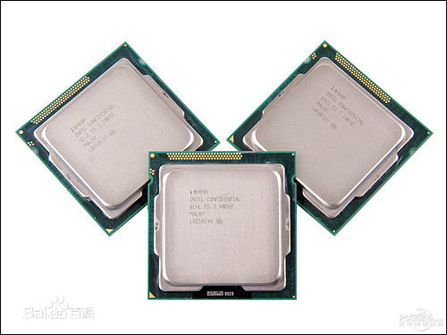
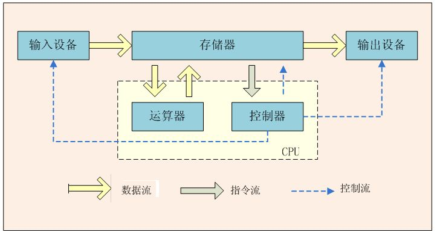
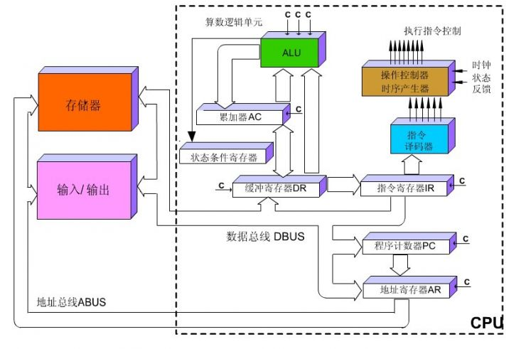
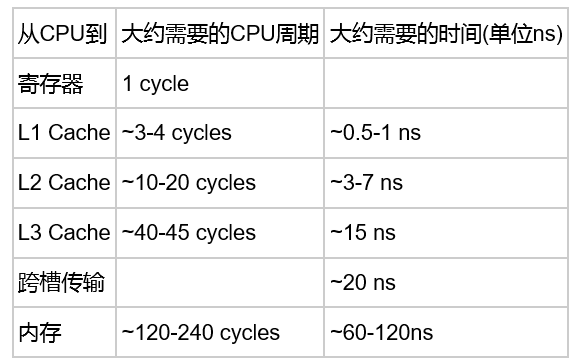

##CPU:计算机硬件系统中最重要的组成部分是中央处理器(Central Processing Unit) 
  

##一、CPU指令系统 
####指令系统指的是一个CPU所能够处理的全部指令的集合，是一个CPU的根本属性。比如我们现在所用的CPU都是采用x86指令集的，他们都是同一类型的CPU，不管是PIII、Athlon或Joshua。我们也知道，世界上还有比PIII和Athlon快得多的 CPU，比如Alpha，但它们不是用x86指令集，不能使用数量庞大的基于x86指令集的程序，如Windows98。之所以说指令系统是一个CPU的根本属性，是因为指令系统决定了一个CPU能够运行什么样的程序。所有采用高级语言编出的程序，都需要翻译（编译或解释）成为机器语言后才能运行，这些机器语言中所包含的就是一条条的指令。 
###1.指令的格式 
一条指令一般包括两个部分：操作码和地址码。操作码其实就是指令序列号，用来告诉CPU需要执行的是那一条指令。地址码则复杂一些，主要包括源操作数地址、目的地址和下一条指令的地址。在某些指令中，地址码可以部分或全部省略，比如一条空指令就只有操作码而没有地址码。 

###2.指令的分类与寻址方式 
现有的指令系统有以下几种类型的指令：算术逻辑运算指令、浮点运算指令、位操作指令和其他指令；对于指令中的地址码，也会有许多不同的寻址（编址）方式，主要有直接寻址，间接寻址，寄存器寻址，基址寻址，变址寻址等，某些复杂的指令系统会有几十种甚至更多的寻址方式。 

###3.CISC与RISC 
CISC，Complex Instruction Set Computer，复杂指令系统计算机。RISC， Reduced Instruction Set Computer，精简指令系统计算机。 
CISC:大量的复杂指令、可变的指令长度、多种的寻址方式是CISC的特点，也是CISC的缺点：因为这些都大大 增加了解码的难度，而在现在的高速硬件发展下，复杂指令所带来的速度提升早已不及在解码上浪费点的时间。除了个人PC市场还在用x86指令集外，服务器以 及更大的系统都早已不用CISC了。x86仍然存在的唯一理由就是为了兼容大量的x86平台上的软件。 
RISC:指令长度固定，指令格式种类少，寻址方式种类少，大多数是简单指令且都能在一个时钟周期内完成，易于设计超标量与流水线，寄存器 数量多，大量操作在寄存器之间进行。由于下文所讲的CPU核心大部分是讲RISC核心，所以这里就不多介绍了，对于RISC核心的设计下面会详细谈到。 

##二、CPU的内部结构： 
  
冯诺依曼架构——存储程序，顺序执行 
###1.算术逻辑单元ALU（Arithmetic Logic Unit） 
ALU主要完成对二进制数据的定点算术运算（加减乘除）、逻辑运算（与或非异或）以及移位操作。在某些CPU中还有专门用于处理移位操作的移位器。 
通常ALU由两个输入端和一个输出端。整数单元有时也称为IEU（Integer Execution Unit）。我们通常所说的“CPU是XX位的”就是指ALU所能处理的数据的位数。 

###2.浮点运算单元FPU（Floating Point Unit） 
FPU主要负责浮点运算和高精度整数运算。有些FPU还具有向量运算的功能，另外一些则有专门的向量处理单元。 
###2.通用寄存器组RS（Register Set或Registers） 
RS实质上是CPU中暂时存放数据的地方，里面保存着那些等待处理的数据，或已经处理过的数据，CPU访问寄存器所用的时间要比访问内存的时间短。采用寄存器，可以减少CPU访问内存的次数，从而提高了CPU的工作速度。但因为受到芯片面积和集成度所限，寄存器组的容量不可能很大。寄存器组可分为专用寄存器和通用寄存器。专用寄存器的作用是固定的，分别寄存相应的数据。而通用寄存器用途广泛并可由程序员规定其用途。通用寄存器的数目因微处理器而异。 

###3.控制单元（Control Unit） 
控制单元是整个CPU的指挥控制中心，由指令寄存器IR(Instruction Register)、指令译码器ID(Instruction Decoder)和操作控制器0C(Operation Controller)三个部件组成，对协调整个电脑有序工作极为重要。它根据用户预先编好的程序，依次从存储器中取出各条指令，放在指令寄存器IR中，通过指令译码(分析)确定应该进行什么操作，然后通过操作控制器OC，按确定的时序，向相应的部件发出微操作控制信号。操作控制器OC中主要包括节拍脉冲发生器、控制矩阵、时钟脉冲发生器、复位电路和启停电路等控制逻辑。 

###4.总线（Bus） 
总线实际上是一组导线，是各种公共信号线的集合，用于作为电脑中所有各组成部分传输信息共同使用的“公路”。直接和CPU相连的总线可称为局部总线。其中包括: 数据总线DB(Data Bus)、地址总线AB(Address Bus) 、控制总线CB(Control Bus)。其中，数据总线用来传输数据信息；地址总线用于传送CPU发出的地址信息；控制总线用来传送控制信号、时序信号和状态信息等。 

##三、CPU的工作流程 
  
CPU的工作原理就像一个工厂对产品的加工过程:进入工厂的原料(程序指令)，经过物资分配部门(控制单元)的调度分配，被送往生产线(逻辑运算单元)，生产出成品(处理后的数据)后，再存储在仓库(存储单元)中，最后等着拿到市场上去卖(交由应用程序使用)。在这个过程中，我们注意到从控制单元开始，CPU就开始了正式的工作，中间的过程是通过逻辑运算单元来进行运算处理，交到存储单元代表工作的结束。 

##四、CPU核心设计 
###1.超标量（Superscalar） 
超流水线是指某些CPU内部的流水线超过通常的5~6步以上，例如Pentium pro的流水线就长达14步。将流水线设计的步(级)数越多，其完成一条指令的速度越快，因此才能适应工作主频更高的CPU。超标量(supe rscalar)是指在CPU中有一条以上的流水线，并且每时钟周期内可以完成一条以上的指令，这种设计就叫超标量技术。 
###2.流水线（Pipeline） 
InteI首次在486芯片中开始使用的。流水线的工作方式就象工业生产上的装配流水线。在CPU中由5~6个不同功能的电路单元组成一条指令处理流水线，然后将一条X86指令分成5~6步后再由这些电路单元分别执行，这样就能实现在一个CPU时钟周期完成一条指令，因此提高CPU的运算速度。由于486CPU只有一条流水线，通过流水线中取指令、译码、产生地址、执行指令和数据写回五个电路单元分别同时执行那些已经分成五步的指令，因此实现了486CPU设计人员预期的在每个时钟周期中完成一条指令的目的(按笔者看法，CPU实际上应该是从第五个时钟周期才达到每周期能完成一条指令的处理速度)。到了Pentium时代、设计人员在CPU中设置了两条具有各自独立电路单元的流水线，因此这样CPU在工作时就可以通过这两条流水线来同时执行两条指令，因此在理论上可以实现在每一个时钟周期中完成两条指令的目的。  
###3.乱序执行技术（out-of-order execution） 
乱序执行(out-of-orderexecution)是指CPU采用了允许将多条指令不按程序规定的顺序分开发送给各相应电路单元处理的技术。比方说程序某一段有7条指令，此时CPU将根据各单元电路的空闹状态和各指令能否提前执行的具体情况分析后，将能提前执行的指令立即发送给相应电路执行。当然在各单元不按规定顺序执行完指令后还必须由相应电路再将运算结果重新按原来程序指定的指令顺序排列后才能返回程序。这种将各条指令不按顺序拆散后执行的运行方式就叫乱序执行(也有叫错序执行)技术。采用乱序执行技术的目的是为了使CPU内部电路满负荷运转并相应提高了CPU的运行程序的速度。 
###4.分支预溯（branch prediction）和推测执行技术（speculation execution） 
分枝预测和推测执行是CPU动态执行技术中的主要内容，动态执行是目前CPU主要采用的先进技术之一。采用分枝预测和动态执行的主要目的是为了提高CPU的运算速度。推测执行是依托于分枝预测基础上的，在分枝预测程序是否分枝后所进行的处理也就是推测执行。 

##五、CPU外核 
###1.解码器 
这是x86CPU才有的东西，它的作用是把长度不定的x86指令转换为长度固定的类似于RISC的指令，并交给RISC内核。解码分为硬件解码和微解码，对于简单的x86指令只要硬件解码即可，速度较快，而遇到复杂的x86指令则需要进行微解码，并把它分成若干条简单指令，速度较慢且很复杂。好在这些复杂指令很少会用到。 

###2.CPU缓存 
一级缓存和二级缓存是为了缓解较快的CPU与较慢的存储器之间的矛盾而产生的，以及缓存通常集成在CPU内核，而二级缓存则是以OnDie或OnBoard的方式以较快于存储器的速度运行。对于一些大数据交换量的工作，CPU的Cache显得尤为重要。 
  
随着多核的发展, CPU Cache分成了三个级别: L1, L2, L3. 级别越小越接近CPU, 所以速度也更快, 同时也代表着容量越小. L1是最接近CPU的, 它容量最小, 例如32K, 速度最快,每个核上都有一个L1 Cache(准确地说每个核上有两个L1 Cache, 一个存数据 L1d Cache, 一个存指令 L1i Cache). L2 Cache 更大一些,例如256K, 速度要慢一些, 一般情况下每个核上都有一个独立的L2 Cache; L3 Cache是三级缓存中最大的一级,例如12MB,同时也是最慢的一级, 在同一个CPU插槽之间的核共享一个L3 Cache. 
  

##六、CPU主要技术参数 
###1.位，字节和字长 
CPU可以同时处理的二进制数据的位数是其最重要的一个品质标志。人们通常所说的16位机、32位机就是指该微机中的CPU可以同时处理16位、32位的二进制数据。早期有代表性的IBM PC/XT、IBM PC/AT与286机是16位机,386机和486机是32位机,586机则是64位的高档微机。CPU按照其处理信息的字长可以分为：八位微处理器、十六位微处理器、三十二位微处理器以及六十四位微处理器等。 
位：在数字电路和电脑技术中采用二进制，代码只有“0”和“1”，其中无论是 “0”或是“1”在CPU中都是一“位”。 
字节和字长：电脑技术中对CPU在单位时间内(同一时间)能一次处理的二进制数的位数叫字长。所以能处理字长为8位数据的CPU通常就叫8位的CPU。同理32位的CPU就能在单位时间内处理字长为32位的二进制数据。由于常用的英文字符用8位二进制就可以表示，所以通常就将8位称为一个字节。字节的长度是不固定的，对于不同的CPU、字长的长度也不一样。8位的CPU一次只能处理一个宇节，而32位的CPU一次就能处理4个宇节，同理字长为64位的CPU一次可以处理8个字节。  

###2.CPU外频 
CPU外频也就是常见特性表中所列的CPU总线频率，是由主板为CPU提供的基准时钟频率，而CPU的工作主频则按倍频系数乘以外频而来。在Pentium时代，CPU的外频一般是60／66MHz，从Pentium II350开始，CPU外频提高到1O0MHz。由于正常情况下CPU总线频率和内存总线频率相同，所以当CPU外频提高后，与内存之间的交换速度也相应得到了提高，对提高电脑整体运行速度影响较大。  

###3.前端总线（FSB）频率 
前端总线也就是以前所说的CPU总线，由于在目前的各种主板上前端总线频率与内存总线频率相同，所以也是 CPU与内存以及L2Cache（仅指Socket7主板）之间交换数据的工作时钟。由于数据传输最大带宽取决所同时传输的数据位宽度和传输频率，即数据带宽=（总线频率(数据宽度）/8。例如Intel公司的PⅡ333使用6 6MHz的前端总线，所以它与内存之间的数据交换带宽为528MB/s =（66×64）/8，而其PⅡ 350则使用100MHz的前端总线，所以其数据交换峰值带宽为800MB/s=（100×64）/8。由此可见前端总线速率将影响电脑运行时CPU与内存、（L2Cache）之间的数据交换速度，实际也就影响了电脑的整体运行速度。因此目前 Intel正开始将其PⅢ的前端总线频率从100MHz向133MHz过渡。 AMD公司新推出的K7虽然使用20 0MHz的前端总线频率，但有资料表明K7CPU内核与内存之间数据交换时钟仍然是100MHz，主频也是以100 MHz为基频倍频的。 

###4.CPU主频 
CPU主频也叫工作频率，是CPU内核(整数和浮点运算器)电路的实际运行频率。在486 DX2CPU之前。CPU的主频与外频相等。从486DX2开始，基本上所有的CPU主频都等于“外频乘上倍频系数”了。CPU的主要技术特征。主频是CPU内核运行时的时钟频率，主频的高低直接影响CPU的运算速度。我们知道仅Pentium就可以在一个时钟周期内执行两条运算指令，假如主频为100MHz的Pentium可以在1秒钟内执行2亿条指令，那么主频为200MHz的Pentium每秒钟就能执行4亿条指令，因此CPU主频越高，电脑运行速度就越快。需要说明的是Cyrix的CPU对主频这项指标是采用PR性能等级参数（Performance Rating）来标称的，表示此时CPU性能相当于Intel某主频CPU的性能。用PR参数标称的CPU实际运行时钟频率与标称主频并不一致。例如MⅡ-300的实际运行频率为233MHz（66×3.5），但PR参数主频标为300MHz，意思就是MⅡ-300相当于Intel的PⅡ-300。不过事实上也仅是MⅡ-300的Business Winston指标（整数性能）能与PⅡ-300相当而已。 

###5.L1和L2 Cache的容量和速率 
L1和L2 Cache的容量和工作速率对提高电脑速度起关键作用，尤其是L2 Cache对提高运行2 D图形处理较多的商业软件速度有显著作用。设置L2 Cache是486时代开始的，目的是弥补L1 Cache（一级高速缓存）容量的不足，以最大程度地减小主内存对CPU运行造成的延缓。CPU的L2 Cache分芯片内部和外部两种。设在CPU芯片内的L2 Cache运行速度与主频相同，而采用PⅡ方式安装在CPU芯片外部的L2 Cache运行频率一般为主频的二分之一，因此其效率要比芯片内的L2 Cache要低，这就是赛扬只有128KB片内Cache但性能却几乎超过同主频P Ⅱ（有512KB但工作时钟为主频一半的片外L2Cache）的重要原因。  

##七、总结 
之前在cse的课上有简单的接触过CPU的基本结构和技术，因此这个文档中有大部分是结合之前学习过的以及网上查阅的资料，而CPU的其他核心设计是我第一次接触的，如超标量、乱序执行技术、分支预溯和推测执行技术，都让我大开眼界。CPU主要技术参数让我从软硬件结合的角度去看待CPU，对CPU有了新的认知角度。

##八、参考文献 
###[Java 理解CPU缓存(CPU Cache)](https://yq.aliyun.com/articles/56916?spm=5176.10695662.1996646101.searchclickresult.3b9d40b9bboiQN) 
###[CPU GPU设计工作原理](https://yq.aliyun.com/articles/49234?spm=5176.10695662.1996646101.searchclickresult.2aac40b98GigE7) 
###[关于现代 CPU，程序员应当更新的知识](https://yq.aliyun.com/articles/87417?spm=5176.10695662.1996646101.searchclickresult.2aac40b98GigE7) 
###[从CPU、GPU再到TPU，Google的AI芯片是如何一步步进化过来的？ ](https://yq.aliyun.com/articles/141328?spm=5176.10695662.1996646101.searchclickresult.5bd540b9QT6dC5) 
###[cpu工作原理简析](https://yq.aliyun.com/articles/57084?spm=5176.10695662.1996646101.searchclickresult.5bd540b9QT6dC5) 
