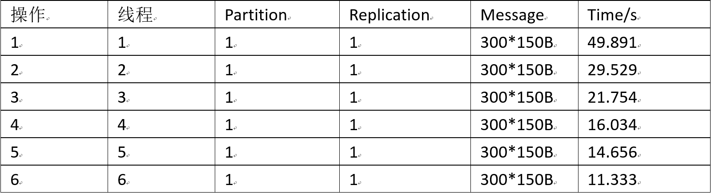
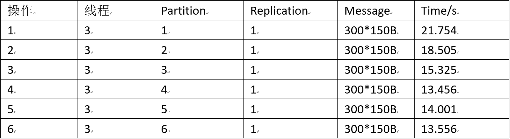
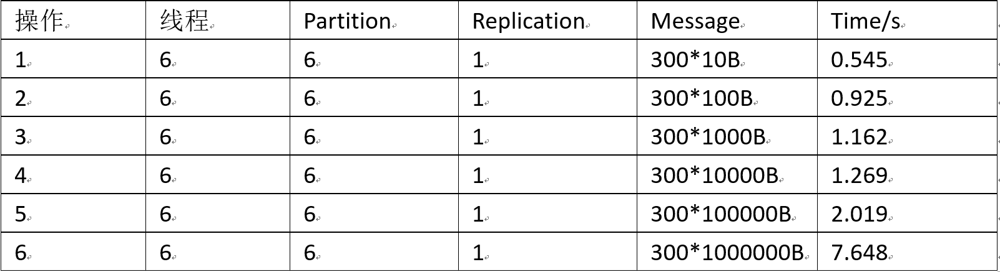
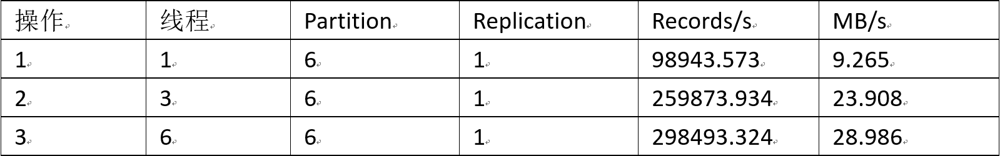
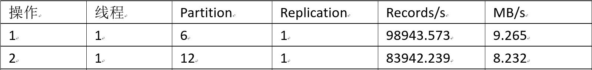
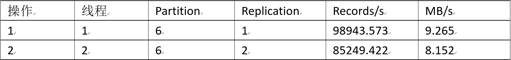
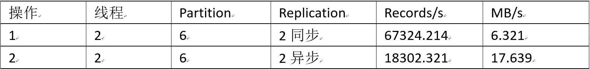
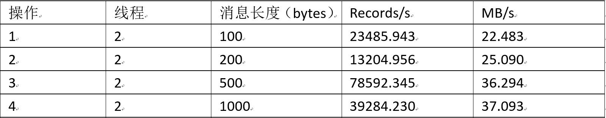
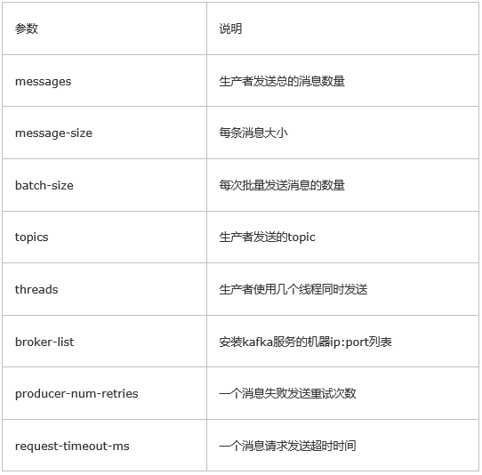

# kafka性能测试
## 一、测试工具
 - python代码
 - kafka-producer-perf-test.sh 

## 二、Producer吞吐率（by python）
### 2.1 线程数
 - 创建一个1个分区，没有备份的topic，设置不同的线程数产生相同量的数据（假设这些数据没有相关性和连续性，即不需要使用lock）。
 - .\bin\windows\kafka-topics.bat --create --zookeeper localhost:2181 --replication-factor 1 --partitions 1 --topic test
 - 运行结果如下表所示：
 </br></br>
 - 初步结论：吞吐率与线程数成正比

### 2.2 分区数
 - 创建没有备份的topic，对于相同线程设置不同的分区数。一般情况下，对于大数据量，partition的数量大于等于broker的数量
 - .\bin\windows\kafka-topics.bat --alter --topic test --zookeeper localhost:2181 --partitions 2
 - 运行结果如下表所示：
 </br></br>
 - 初步结论：分区数小于线程数时，吞吐率随分区的增多明显提高；当分区数大于线程数时，分区数越多，吞吐率减少。

### 2.3 消息长度
 - 修改message的长度（字符串）
 - 运行结果如下表所示：
 </br></br>
 - 初步结论：基于短消息，由于payload的原因，message的大小几乎没有对吞吐率的影响，而随着消息长度增大，records/second会减小，但MB/second会提高。

### 2.4 py代码

```
	from kafka import KafkaProducer
	import json
	import threading
	import datetime
	
	msg_dict = {
	    "port": 9092,
	    "db_config": {
	        "database": "test",
	        "host": "127.0.0.1",
	        "user": "",
	        "password": "root"
	    },
	    "table": "msg",
	    "msg": "Hello World"
	}
	
	v=1000000
	s = ""
	for i in range(v):
	    s = s + "a"
	
	class myThread (threading.Thread):  
	    def __init__(self, tid,name):
	        threading.Thread.__init__(self)
	        self.tid = tid
	        self.name = name
	    def run(self):                 
	        #m = msg_dict
	        msg = s
	        #m['db_config']['user'] = self.name
	        #msg = json.dumps(m)
	        producer = KafkaProducer(bootstrap_servers=['127.0.0.1:9092'])  #此处ip可以是多个['0.0.0.1:9092','0.0.0.2:9092','0.0.0.3:9092' ]
	        for i in range(10):
	            producer.send('test', bytes(msg,encoding='utf-8'))
	        producer.close()
	
	threadList = ["Thread-1", "Thread-2", "Thread-3","Thread-4", "Thread-5", "Thread-6"]
	threads = []
	threadID = 1
	
	for tName in threadList:
	    thread = myThread(threadID, tName)
	    thread.start()
	    threads.append(thread)
	    threadID += 1
	    
	starttime = datetime.datetime.now()
	for t in threads:
	    t.join()
	
	endtime = datetime.datetime.now()
	diff = endtime-starttime
	print ("time using: "+str(diff))
```

##三、Producer（by kafka-producer-perf-test.sh ）
### 3.1 线程数
 - 创建一个6个分区，没有备份的topic，设置不同的线程数生产相同量的数据，查看性能变化。
 - .\bin\windows\kafka-topics.bat--create --zookeeper localhost:2181 --topic test-rep-one --partitions 6--replication-factor 1 （创建topic）
 - .\bin\windows\kafka-producer-perf-tests.bat --messages 50000000  --topics test-rep-one --threads 3 --broker-list 127.0.0.1：9092（三个线程）
 - 运行结果如下表所示
 </br></br>

### 3.2 分区数
 - 新建topic，改变分区数，生产等量数据，查看性能变化。一般情况下，对于大数据量，partition的数量大于等于broker的数据。
 - .\bin\windows\kafka-topics.bat --create --zookeeper localhost:2181 --topic test-rep-one-part --partitions 12--replication-factor 1 （创建topic）
 - .\bin\windows\kafka-producer-perf-tests.bat --messages 50000000  --topics test-rep-one-part --threads 1 --broker-list 127.0.0.1：9092（1个线程）
 - 运行结果如下表所示
 </br></br>

### 3.3 备份数
 - 新建topic，改变分区数，生产等量数据，查看性能变化。可以推断吞吐性能会随备份数增多而减少
 - .\bin\windows\kafka-topics.bat--create --zookeeper localhost:2181 --topic test-rep-two --partitions 6--replication-factor 2 （创建topic）
 - .\bin\windows\kafka-producer-perf-tests.bat --messages 50000000  --topics test-rep-two --threads 2 --broker-list 127.0.0.1：9092（2个线程）
 - 运行结果如下表所示
 </br></br>
 - 初步结论：备份数越多，吞吐率越低。

### 3.4 同步异步
 - 分别以同步异步方式，生产等量数据，查看性能变化。
 - .\bin\windows\kafka-topics.bat--create --zookeeper localhost:2181/kafka --topic test-rep-two_2  --partitions 6 --replication-factor 2（创建topic）
 - .\bin\windows\kafka-producer-perf-tests.bat--messages 50000000 --topics test-rep-two_2 --threads 2 --broker-list 127.0.0.1：9092  --sync （同步产生数据）
 - .\bin\windows\kafka-producer-perf-tests.bat --messages 50000000 --topics test-rep-two_2 --threads 2 --batch-size 5000 --broker-list 127.0.0.1：9092  --request-timeout-ms 100000 （异步产生数据）
 - 运行结果如下表所示
 </br></br>
 - 结论：异常产生数据比同步产生数据吞吐率高近3倍。

### 3.5 数据长度
 - .\bin\windows\kafka-producer-perf-tests.bat--messages 50000000 --topics test-rep-two_2 --threads 2 --batch-size 3000 --broker-list 127.0.0.1:9092  --request-timeout-ms 100000 --message-size 200（异步产生数据）
 - 运行结果如下表所示
 </br></br>

### 3.6 kafka-producer-perf-test.sh参数说明
</br></br>

## 注：
 - 该测试只测试Producer的吞吐率，分别通过python和kafka提供的测试工具来进行分析，在使用python时，2.1和2.2由于代码中每次for循环的时候都对结构体处理并发送，所以整体运行时间大大增加，但并不影响实验结果。